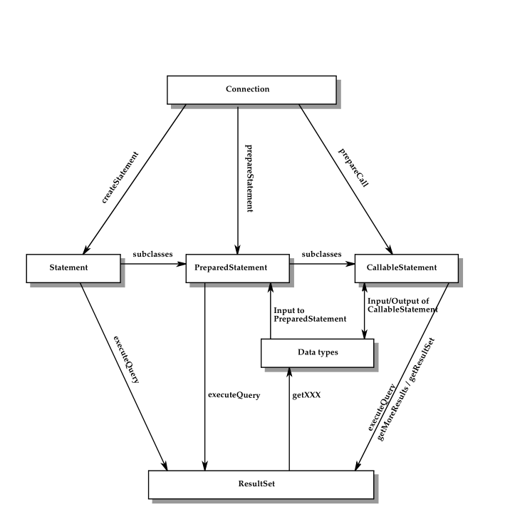
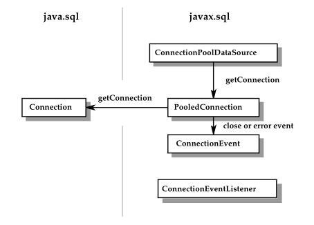
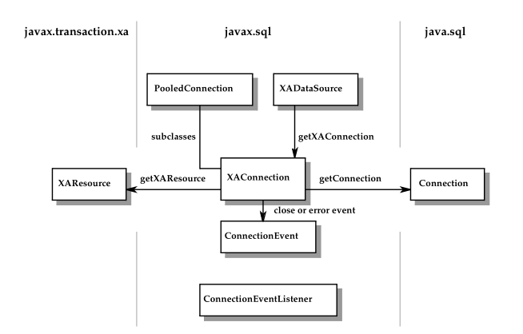
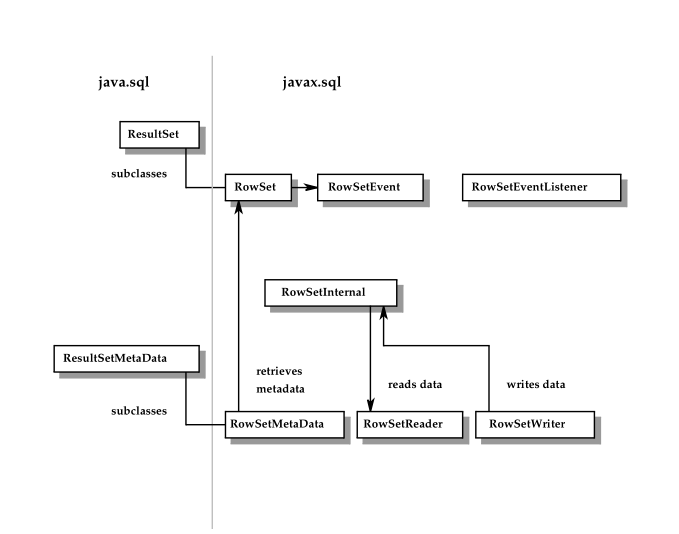

# 类和接口

> 这些事组成JDBC的接口和类

## 5.1 `java.sql`

 JDBC的核心APi是在`java.sql`包内。以下列举了对应的接口和类以及枚举

- 类&枚举：
  - `java.sql.BatchUpdateException`
  - `java.sql.DataTruncation`
  - `java.sql.Date`
  - `java.sql.DriverManager`
  - `java.sql.DriverPropertyInfo`
  - `java.sql.JDBCType`
  - `java.sql.PseudoColumnUsage`
  - `java.sql.RowIdLifeTime`
  - `java.sql.SQLClientInfoException`
  - `java.sql.SQLDataException`
  - `java.sql.SQLException`
  - `java.sql.SQLFeatureNotSupportedException`
  - `java.sql.SQLIntegrityConstraintViolationException`
  - `java.sql.SQLInvalidAuthorizationSpecException`
  - `java.sql.SQLNonTransientConnectionException`
  - `java.sql.SQLNonTransientException`
  - `java.sql.SQLWarning`
  - `java.sql.Time`
  - `java.sql.Timestamp`
  - `java.sql.Types`
  - 
- 接口：
  - `java.sql.Array`
  - `java.sql.Blob`
  - `java.sql.CallableStatement`
  - `java.sql.Clob`
  - `java.sql.ClientinfoStatus`
  - `java.sql.Connection`
  - `java.sql.DatabaseMetaData`
  - `java.sql.Driver`
  - `java.sql.DriverAction`
  - `java.sql.NClob`
  - `java.sql.ParameterMetaData`
  - `java.sql.PreparedStatement`
  - `java.sql.Ref`
  - `java.sql.ResultSet`
  - `java.sql.ResultSetMetaData`
  - `java.sql.RowId`
  - `java.sql.Savepoint`
  - `java.sql.SQLData`
  - `java.sql.SQLInput`
  - `java.sql.SQLOutput`
  - `java.sql.SQLPermission`
  - `java.sql.SQLType`
  - `java.sql.SQLXML`
  - `java.sql.Statement`
  - `java.sql.Struct`
  - `java.sql.Wrapper`

以下类和接口在JDBC 4.2 API中是新的或更新的。

- 更新的类或接口
  - `java.sql.BatchUpdateException`
  - `java.sql.CallableStatement`
  - `java.sql.Connection`
  - `java.sql.DatabaseMetaData`
  - `java.sql.Date`
  - `java.sql.Driver`
  - `java.sql.DriverManager`
  - `java.sql.Permission`
  - `java.sql.PreparedStatement`
  - `java.sql.ResultSet`
  - `java.sql.SQLInput`
  - `java.sql.SQLOutput`
  - `java.sql.SQLXML`
  - `java.sql.Statement`
  - `java.sql.Types`
  - `java.sql.Timestamp`
  - `javax.sql.XADataSource`
  
- 新增的类或接口
  - `java.sql.DriverAction`
  - `java.sql.JDBCType`
  - `java.sql.SQLType`

   下图显示了`java.sql`包在关键类和接口之间的作用和关系。还显示了创建语句、设置参数以及检索结果的方法
  
  

## 5.2 `javax.sql`包

以下为javax.sql包的类和接口

类：

- `javax.sql.ConnectionEvent`
- `javax.sql.RowSetEvent`
- `javax.sql.StatementEvent`

接口：

- `javax.sql.CommonDataSource`
- `javax.sql.ConnectionEventListener`
- `javax.sql.ConnectionPoolDataSource`
- `javax.sql.DataSource`
- `javax.sql.PooledConnection`
- `javax.sql.RowSet`
- `javax.sql.RowSetInternal`
- `javax.sql.RowSetListener`
- `javax.sql.RowSetMetaData`
- `javax.sql.RowSetReader`
- `javax.sql.RowSetWriter`
- `javax.sql.StatementEventListener`
- `javax.sql.XAConnection`
- `javax.sql.XADataSource`

> 备注：这些`javax.sql`包的类和接口在JDBC2.0 中初次使用，在J2SE 1.2中是一个可选包。找J2SE1.4后，`javax.sql`和`java.sql`一样成为了Java平台的一部分

以下展示了`javax.sql.DataSource`和`java.sql.Connection`的关系

以下 展示了连接池的关系

下图展示了分布式事务有关的组成部分

以下为`RowSet`的关系

