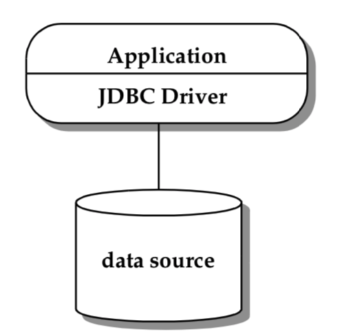

# 概述

​		JDBC API为Java程序提供了一种访问一个或多个数据源的方法。 在大多数情况下，数据源是关系DBMS，并且可以使用SQL访问其数据。 但是，在使用JDBC技术的驱动程序也有可能在其他数据源之上实现，包括旧文件系统和面向对象的系统。 JDBC API的主要动机是为应用程序提供访问各种数据源的标准API。

​		本章介绍了JDBC API的一些关键概念。 此外，它描述了JDBC应用程序的两种使用环境。分别是两层模型和三层模型，在不同的场景中，JDBC API 的功能是不一样的

## 4.1 建立连接

JDBC API定义了一个`Connection` 的接口 来代表 与某个数据源的连接

在一般情况下，一个JDBC应用程序会使用如下两种方式连接目标数据

- `DriverManager`：这个类是在JDBC1.0的时候就已经引入了。当一个程序第一次加载数据源的时候，`DriverManager`会自动的从CLASSPATH下加载对应的JDBC程序(在JDBC4.0之前需要手动加载)
- `DataSource`:这个接口在JDBC 2.0 Optionnal Package API 中被引入。很多时候更推荐使用`DataSource`因为这个接口相对于`DriverManager`数据源的实现对于应用来说是透明的。一个`DataSource`只需要设置必要的一些的属性，当这个`getConnection`方法被执行的时候，`DataSource`将会返回一个数据源的实例。而应用可以改变对应的属性来获取不同的数据源。同时，一个`DataSource`可以在不改变代码的情况下进行改变

JDBC API还定义了两个重要的扩展的DataSource接口支持企业应用。

- `ConnectionPoolDataSource`:可支对物理连接的缓存和重用。用于提高应用的性能和扩展性
- `XADataSource`:提供对分布式事务的支持

## 4.2 执行脚本并操作结果集

一旦连接被建立之后，应用程序可以使用JDBC API可以方便的执行对应的查询和更新对应的数据源。JDBC对于	`SQL 2003`提供了最常用的支持。但是由于不同厂商对于这些功能的支持各不相同，所以我们定义了`DatabaseMetadata`接口，应用程序可以使用该接口，用于确定他们是否有该功能。JDBV还定义了转义语法，允许应用程序去访问一些非标准的、某个数据库厂商独有的特性。使用转义语法能够让使用 JDBC API 的应用程序像原生应用程序一样去访问某些特性，并且也提高了应用的可移植性。

应用程序介意使用`Connection`定义的方法去指定事务的属性和创建`Statement`,`PreparedStatement`,`CallableStatement`

这些语句可以用于执行SQL脚本和返回对应的数据结果集。`ResultSet`用于返回SQL数据查询结果集。`statements`可批量执行，应用能够在一次执行中，向数据库提交多条更新语句，作为一个执行单元。

JDBC中的`ResultSet`接口扩展了`RowSet`接口，提供了一个更全面对于表格结果集进行封装和处理的容器。一个`RowSet`是JavaBean中的组件，在底层数据源断开的情况下他还是可以操作数据源。比如说一个`RowSet`可被序列化的对象，通过网络发送出去。这对于希望使用表格数据而不占用JDBC驱动程序和数据源连接的开销的客户端程序特别有用。`RowSet`实现的的另一个功能:在与数据源断开连接的情况下，对行数据进行改写，并且能够包含一个定制化的 writer，把改写后的数据写回底层的数据源。

## 4.2.2 对 SQL 高级数据类型的支持

JDBC 定义了一套标准的用于将SQL数据类型到JDBC数据类型相互转换的规则。其中包括SQL2003标准中的高级数据类型支持：比如说 BLOB, CLOB, ARRAY, REF, STRUCT, XML, DISTINCT。JDBC可以自定义转换规则（user-defined types, UDTS）。该用户定义的UDT能够映射到 Java 语言中的某个类。JDBC API 也提供了对外部数据的访问，比如说存储在文件里，但不受数据源管理的数据。

## 4.3 两层模型

两层模型定义了客户端层和服务端层，不同层实现不同的功能，如下图所示:

这个客户层包括应用程序以及一个或者多个 JDBC 驱动，这一层的主要职责是：

- 表现逻辑（presentation logic）
- 业务逻辑 (business logic)
- 多语句执行事务以及对应的分布式事务
- 资源管理

在这种模型中，应用程序直接与 JDBC 驱动交互，包括创建和管理物理连接，处理底层数据库的细节。应用程序可能会基于对底层数据源的类型的认知，去访问一些特有的、非标准的特性，以此来获得性能上的提升

这个模型有一些缺点，如下所示：

- 将表现层和业务层逻辑与底层的功能直接混合，这会使代码变得难以维护
- 应用程序不具有可移植性，因为应用程序会使用到底层特定数据库的一些独有的特性，对于需要与多种数据源进行连接的应用程序来说，要特别注意不同厂商的数据库实现以及不同的特性。
- 限制了可扩展性。应用程序将会一直持有与数据库的连接，直到应用程序退出，这就限制了并发访问数据库的并发数，在这种模型中，所谓的性能、可扩展性以及可用性，需要 JDBC 驱动以及底层的数据库来共同保证。如果应用程序使用的 JDBC 驱动不止一种，那么情况就会更加复杂。 

## 4.4 三层模型

三层模型引入了一个中间层，来处理业务逻辑并作为基础中间层。详见下图

   该架构对于企业级应用而言，性能和可扩展性以及可用性都能得到提升，各层的职责如下：

1. 客户端层：一个高度抽象的应用表现层。其只需要和中间层进行交互，无需了解中间层的基础架构和底层数据源的实现细节。
2. 中间层服务层：
   1. 应用层(**Applications**):实现了相关的业务逻辑，并与客户端进行交互的应用程序，如果应用程序需要和底层数据进行交互，则她只需要关注更高层次的抽象和逻辑连接，无需关注底层驱动的API。例如：DataSource
   2. 应用服务层(**An application server**):为广泛的程序提供基础架构的支持。其中包括连接池的管理和池化以及事务管理。对于不同厂商的JDBC驱动程序之间的差异进行屏蔽。从而使得能让我们写出可移植的应用程序。应用服务器这个角色可以由Java EE服务器来承担。应用服务器主要实现提供给应用程序使用的抽象层，并负责与JDBC程序进行交互
   3. JDBC驱动程序(**JDBC driver(s)** ):其用于提供与底层数据源进行连接。每个驱动程序都会根据其底层数据源的特性去实现标准的JDBC API。驱动层可能会屏蔽掉SQL 2003标准与数据源支持的SQL方言之间的不同。如果底层数据源并不是一个关系型数据库，驱动程序则需要实现对应的关系层逻辑，提供给应用服务器使用
3. 底层数据源：这是一个数据存储层。可以包含关系型数据库，文件系统，面向对象数据库，数据仓库等等任何可以存储数据的东西上。但是他们都需要提供符合JDBC API规范的驱动程序

## 4.5 JDBC 和Java EE平台

Java EE组件（例如JavaServerTM Pages，Servlet和Enterprise Java BeansTM（EJBTM）组件）通常需要使用JDBC API进行访问关系数据。 当Java EE组件使用JDBC API时，容器将管理其事务和数据源。 这意味着Java EE组件开发人员不会直接使用JDBC API的事务和数据源管理工具。 有关更多详细信息，请参见Java EE平台规范。